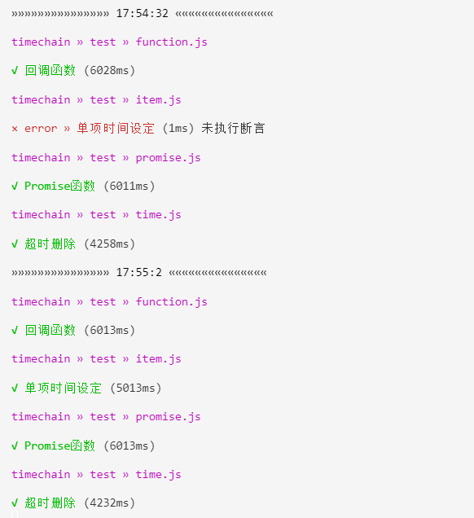

# JTF

如果你用过ava、tap，会发现它们的执行速度真的很慢。特别是ava慢的难以置信，且大量占用CPU，导致糟糕的开发体验。

tape性能还不错，但它依然是个半成品，需要自行扩充，而且必须使用end()方法来结束测试代码，这样做似乎显得有些多余。


### 特性

* jtf本身非常轻量且高效。

* 仅使用node.js内置的assert断言模块。

* 使用ava测试代码风格，部分兼容ava测试代码。

* 支持同步和异步两种模式，同步时序更利于调试，异步则执行速度更快。

* 使用cluster主进程搭配一个或多个工作进程，master用于文件监听，worker执行测试文件。

### 示例

```js
let test = require('jtf')

test('sync', t => {

   t.deepEqual({ a: 1 }, { a: 1 });

   t.equal(true, true);

})

test('async', async t => {

   t.equal(true, true);

   t.ok(true);

})
```

### Install

必须同时安装本地和全局依赖

```
npm install jtf

npm install jtf -g
```


### cli的使用

在项目根目录下通过cli执行全局变量jtf，无参数时会执行test目录下的所有.js测试文件。

#### 可选参数

* -v, --version 版本信息

* -w, --watch 测试文件监听

* -a, --async 异步执行测试代码



### 可选配置

在项目根目录package.json中添加配置项，可灵活控制测试文件的监听范围。

```json
{
   "jtf":{
      "test": {
         "path": "test/",
         "exclude": ["helpers"]
      },
      "app": {
         "path": "app/"
      }
   }
}
```